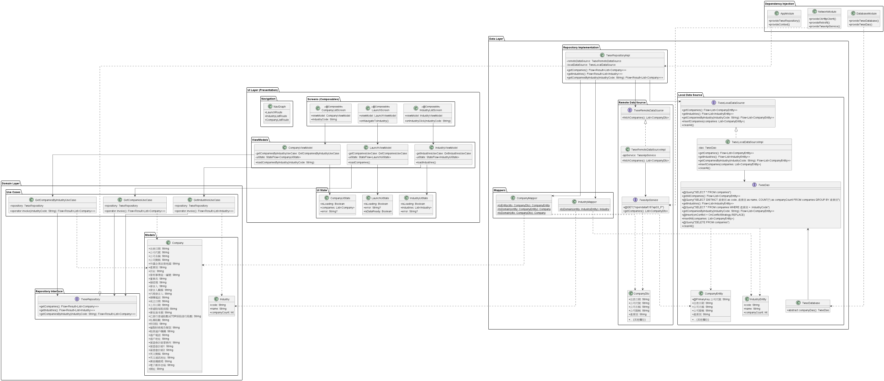

# TWSE Android APP

一個讀取台灣證券交易所 (TWSE) Open API 的 Android 應用程式，採用 Clean Architecture + MVVM 架構設計。

## 功能特色

- 📊 **公開發行公司基本資料**：從 TWSE Open API 取得最新公司資訊
- 🏭 **產業別分類**：顯示 40 個 TSE 產業類別及公司數量
- 📱 **現代化 UI**：使用 Jetpack Compose 打造流暢的使用者體驗
- 🔄 **離線優先**：支援離線瀏覽，提升使用者體驗
- 🧪 **完整測試**：包含單元測試、整合測試和 UI 測試

## 架構設計

本專案採用 Android 官方推薦的三層架構：



### 架構分層

- **UI Layer (Presentation)**
  - Jetpack Compose 畫面
  - ViewModel 處理業務邏輯
  - Navigation Compose 導航

- **Domain Layer (Business Logic)**
  - Use Cases 封裝業務邏輯
  - Domain Models 純業務物件
  - Repository Interface 定義資料存取

- **Data Layer (Data Management)**
  - Repository Implementation 實作離線優先策略
  - Remote Data Source (Retrofit + TWSE API)
  - Local Data Source (Room Database)

## 技術棧

- **UI**: Jetpack Compose + Navigation Compose
- **架構**: MVVM + Clean Architecture
- **依賴注入**: Hilt (Dagger)
- **網路**: Retrofit + OkHttp + Gson
- **資料庫**: Room
- **非同步**: Kotlin Coroutines + Flow
- **測試**: JUnit 5 + MockK + Compose Testing

## 專案結構

```
app/src/main/java/com/hm/cursorpracticetwse/
├── di/                          # 依賴注入
├── data/                        # 資料層
│   ├── remote/                  # 遠端資料源
│   ├── local/                   # 本地資料源
│   ├── repository/              # Repository 實作
│   └── mapper/                  # 資料轉換
├── domain/                      # 領域層
│   ├── model/                   # 領域模型
│   ├── repository/              # Repository 介面
│   └── usecase/                 # 業務邏輯
└── ui/                          # UI 層
    ├── navigation/              # 導航
    ├── launch/                  # 啟動頁面
    ├── industry/                # 產業列表
    └── company/                 # 公司列表
```

## 主要畫面

### 1. Launch 頁面
- 顯示載入動畫
- 自動呼叫 TWSE API 更新公司資料
- 資料載入完成後導航至產業別頁面

### 2. 產業別頁面
- 顯示 40 個 TSE 產業類別
- 每個類別顯示公司數量
- 點擊進入該產業的公司列表

### 3. 公司列表頁面
- 顯示該產業的所有公司
- 包含公司基本資訊（名稱、代號、地址等）
- 支援搜尋和篩選功能

## API 資料來源

使用台灣證券交易所 Open API：
- **端點**: `https://openapi.twse.com.tw/v1/opendata/t187ap03_P`
- **資料**: 公開發行公司基本資料
- **格式**: JSON
- **更新頻率**: 每日更新

## 開發流程

### 階段 1: 環境設定
- 設定專案依賴 (Hilt, Retrofit, Room, Navigation)
- 配置 Hilt Application

### 階段 2: Domain Layer
- 實作領域模型和 Use Cases
- 定義 Repository 介面

### 階段 3-4: Data Layer
- 實作 Remote Data Source (API)
- 實作 Local Data Source (Room)
- 實作 Repository 和 Mapper

### 階段 5-8: UI Layer
- 實作 Launch, Industry, Company 畫面
- 整合 Navigation

### 階段 9-10: 測試與優化
- 完整測試覆蓋
- 效能優化

## 測試策略

- **單元測試**: Domain Layer, Data Layer, ViewModels
- **整合測試**: Database, Network, Navigation
- **UI 測試**: Compose 元件和 E2E 流程

## 建置與執行

```bash
# 安裝依賴
./gradlew build

# 執行測試
./gradlew test
./gradlew connectedAndroidTest

# 建置 APK
./gradlew assembleDebug
```

## 需求規格

- **最低 Android 版本**: API 28 (Android 9.0)
- **目標 Android 版本**: API 36 (Android 15)
- **開發語言**: Kotlin
- **建置工具**: Gradle 8.13.0

## 授權

本專案僅供學習和練習使用。

---

**注意**: 本應用程式使用台灣證券交易所的公開 API，請遵守相關使用條款。
